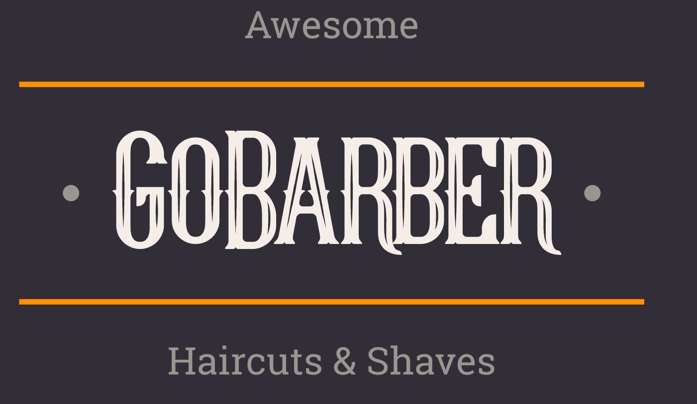

<p align="center">
   
</p>

# :page_with_curl: Table of Contents

* [About](#information_source-about)
* [Technologies](#computer-technologies)
* [Features](#rocket-features)
* [How to run](#seedling-how-to-run)
* [License](#pencil-license)

# :information_source: About

GoBarber is a application to make appointments with hairdressers or barbers. The application has Web and [Mobile](https://github.com/lucas-almeida-silva/gobarber-app) versions, that was developed during the bootcamp GoStack offered by RocketSeat. This is the Web project, that consumes GoBarber [API](https://github.com/lucas-almeida-silva/gobarber-api).

# :computer: Technologies

- ReactJS
- Typescript
- Styled Components

# :rocket: Features

The web application is exclusive to service providers. The application for customers is the [mobile app](https://github.com/lucas-almeida-silva/gobarber-app)

### Users

- Create an user
- Update user avatar
- Update user profile
- Login and logout
- Recover password

### Providers

- List the appointments of a day.
- List the availability in a month (whether or not there are times available on each day of the month).
- List the availability in a day (available and unavailable times).

# :seedling: How to run

```bash
# Clone the repository
$ git clone https://github.com/lucas-almeida-silva/gobarber-web.git

# Go to the project folder
$ cd gobarber-web

# Install Dependencies
$ yarn
# or npm install

# Run the application
$ yarn start
# or npm start
```
Access the API at http://localhost:3000

To run the application, you need to create the environment variable file at the root of the project. The file should be called **.env**. There is a file called **.env.example** at the root of the project with the necessary variables.

# :pencil: License

This project is under the [MIT license](LICENSE).
